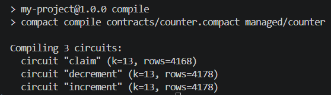
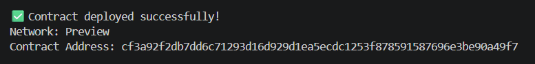

# Midnight Private Counter

> A privacy-aware Midnight counter that lets an owner increment or decrement public state by proving knowledge of a private secret key.

## Contract Address

| Network | Address |
|---------|---------|
| Preview | `cf3a92f2db7dd6c71293d16d929d1ea5ecdc1253f878591587696e3be90a49f7` |
| Preprod | NOT DEPLOYED YET |

## What This Does

This project implements an owner-controlled counter on the Midnight network. A user first calls `claim()` to register a public commitment derived from a secret key. After ownership is claimed, `increment()` increases the public `round` counter by one and `decrement()` decreases it by one. Both counter operations require a zero-knowledge proof that the caller knows the secret behind the registered commitment.

The contract therefore makes the counter value and owner commitment auditable on-chain without publishing the owner's raw secret. The repository also includes TypeScript witness code, contract tests, wallet and network helpers, deployment tooling, and a Docker Compose environment for local development.

The primary contract is [`contracts/counter.compact`](contracts/counter.compact). Generated Compact artifacts are written to `managed/counter/`.

## Privacy Model

- **What is PUBLIC (on-chain, visible to anyone):** The `round` counter; the 32-byte `owner` commitment; contract calls, state transitions, and transaction metadata. The commitment is a persistent hash derived from the owner's secret key, not the raw key itself.
- **What is PRIVATE (private witness, never on-chain):** The 32-byte `secretKey` witness held in the user's local private state. It is supplied to the Compact circuit by `src/witnesses.ts` and is never written to a public ledger field.
- **What the user PROVES without revealing:** For `increment()` and `decrement()`, the caller proves knowledge of a secret key whose derived commitment equals the public `owner` value. This proves authorization without revealing the secret key. During `claim()`, only the derived commitment is deliberately disclosed.

Keep `.midnight-state.json`, `.midnight-wallet-state/`, `counter-state/`, mnemonic phrases, wallet seeds, and private-state passwords secret. Do not commit or share them.

## Tech Stack

- Midnight network
- Compact language
- Node.js v22
- Docker

The TypeScript tooling uses Midnight.js, the Midnight Wallet SDK, `tsx`, and Node's built-in test runner.

## Prerequisites

Install the following before running the project:

- Git
- Node.js v22 or newer and npm
- Docker Engine with Docker Compose v2 (or Docker Desktop)
- The Midnight Compact compiler, with the `compact` executable available on `PATH`
- Enough disk space and memory for the Midnight node, indexer, and proof-server images
- For Preview or Preprod: network access and faucet-funded tNIGHT for the generated wallet

Verify the main tools:

```bash
node --version
npm --version
docker --version
docker compose version
compact --version
```

## Setup

1. Clone the repository and enter the project directory:

   ```bash
   git clone <repository-url>
   cd my-project
   ```

2. Install the locked Node.js dependencies:

   ```bash
   npm ci
   ```

3. Compile the Compact contract:

   ```bash
   npm run compile
   ```

4. Start the local Midnight services and deploy to the local `undeployed` network:

   ```bash
   npm run setup
   ```

   This starts the node, indexer, and proof server with Docker Compose, recompiles the contract, creates or restores a local wallet, and deploys the counter. The generated wallet and deployment details are recorded locally.

5. To deploy to a public test network instead, choose Preview or Preprod:

   ```bash
   npm run setup -- --network preview
   # or
   npm run setup -- --network preprod
   ```

   On a public network, setup prints the generated wallet address and faucet URL if funding is required. Fund the address with tNIGHT and allow setup to continue. Set a strong private-state password before using a non-local target:

   ```bash
   export PRIVATE_STATE_PASSWORD='<a-strong-password-of-at-least-16-characters>'
   npm run setup -- --network preview
   ```

6. After deployment, copy the printed contract address into the **Contract Address** table above.

Useful commands:

```bash
npm run proof-server:start  # Start Docker services
npm run proof-server:stop   # Stop Docker services
npm run deploy -- --network preview
npm run check-balance
npm run network
```

To stop the local stack:

```bash
docker compose down
```

Add `-v` only when you intentionally want to delete the local Docker volumes and reset local chain data.

## Run Tests

Compile the contract first if `managed/counter/` is absent or stale, then run the test suite:

```bash
npm run compile
npm test
```

The tests exercise claiming ownership, authorized increments and decrements, rejection of an unauthorized caller, and confirmation that the raw private secret does not appear in public ledger state.

## Initial Idea

[LEAVE PLACEHOLDER — I will fill this in manually]

## Screenshots

### Compile Output

### Preview Deployment
